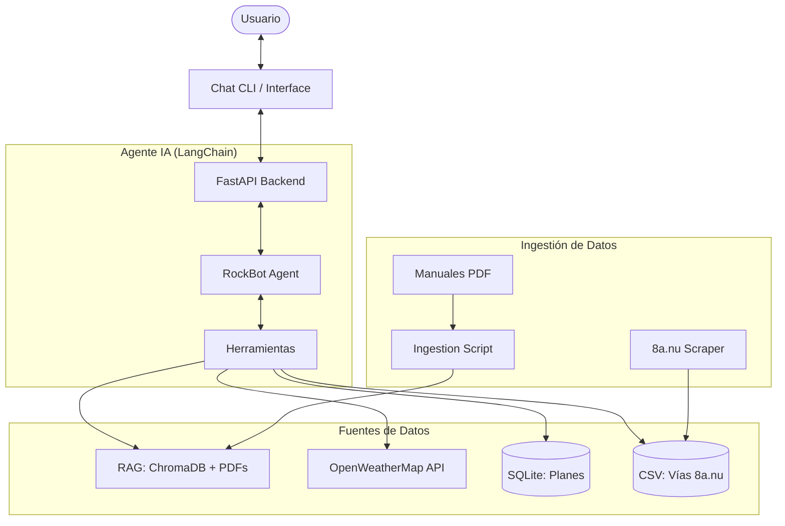

# RockBot Planner 🧗 - Guía de Escalada Inteligente

**RockBot Planner** es un ecosistema inteligente diseñado para ayudar a escaladores deportivos en España a planificar sus salidas de forma segura y eficiente. Utiliza un **Agente de IA** con arquitectura **ReAct** (Reasoning + Acting) para integrar datos de diversas fuentes, desde manuales técnicos en PDF hasta datos meteorológicos en tiempo real y bases de datos de vías de escalada.

## 🏗️ Arquitectura del Proyecto



## 🚀 Características Principales

- **Agente LangChain ReAct**: Utiliza `gemma4:26b` local vía Ollama para razonar y ejecutar herramientas.
- **RAG Personalizado**: Indexación de manuales técnicos de escalada en una base de datos vectorial (ChromaDB) para consultas de seguridad y técnica.
- **Web Scraping Avanzado**: Extracción de datos de miles de vías en España desde `8a.nu` mediante Playwright.
- **Planificación Dinámica**: Generación de itinerarios que incluyen pronóstico del tiempo a 5 días y coordenadas precisas.
- **Visualización en Mapa**: Interfaz React con paneles interactivos y mapa Leaflet para visualizar destinos de escalada.

## 🛠️ Requisitos Previos

- **Python 3.9+**
- **Node.js v18+**
- **Ollama** con los siguientes modelos:
  - `gemma4:26b` (LLM de razonamiento)
  - `mxbai-embed-large` (Embeddings para RAG)
- **API Key** de OpenWeatherMap.

## ⚙️ Configuración e Instalación

### 1. Clonar y preparar el entorno
```bash
git clone <url-del-repo>
cd Practica_9_Agentes_IA
python -m venv venv
source venv/bin/activate  # Linux/macOS
```

### 2. Instalar dependencias
```bash
pip install -r requirements.txt
playwright install chromium
```

### 3. Configurar variables de entorno
Crea un archivo `.env` en la raíz:
```env
OPENWEATHER_API_KEY=tu_api_key_aqui
```

### 4. Preparar los datos (Opcional si ya están incluidos)
```bash
# Para scrapear nuevas vías (8a.nu)
python -m RAG.scraper --url "https://www.8a.nu/crags/sportclimbing/spain"

# Para indexar manuales PDF en ChromaDB
python -m RAG.ingestion
```

## 🏃 Ejecución

### Backend (Servidor API)
```bash
python -m API.main
```
El servidor estará disponible en `http://localhost:8000`.

### Frontend (Interfaz Web)
```bash
cd frontend
npm install
npm run dev
```
Accede a `http://localhost:5173`.

### Cliente de Chat (CLI rápido)
Si prefieres interactuar sin la interfaz web:
```bash
python chat.py
```

## 📂 Estructura del Proyecto

- `API/`: Lógica central del sistema, definición del agente, herramientas y persistencia SQLite.
- `RAG/`: Scripts de scraping (`scraper.py`), ingestión de documentos (`ingestion.py`) y archivos de datos.
- `frontend/`: Aplicación React completa con gestión de estado y visualización geográfica.
- `chroma_db/`: Almacenamiento persistente de los vectores de embeddings.

---
*Desarrollado como parte de la Práctica IX de Agentes de IA.*
